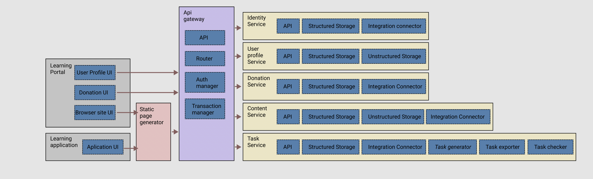

- **Learning Portal** - The main web portal for online access.
  - **User Profile** UI is a web interface for interacting with information about the user and their learning outcomes.
  - **Donation UI** -web interface for working with donation functionality.
  - **Browser site UI** - web interface for the main functionality of the portal.

- **Learning application** - additional application for getting access to offline learning materials.
- **Static page generator** - service that generates from static files with the content of a web page.
- **API gateway** - service that routes requests to basic functional services.
- **Identity Service** - service that deals with user authentication and authorization on the portal.
- **User profile Service** - service that works with user profile data.
- **Donation Service** - service for working with donation functionality.
- **Content Service** - service for working with educational content on the portal.

- **Task Service** - service for working with practical exercises.
  - **Task generator** - generates personalized tasks for each practice exercise.
  - **Task exporter** - prepares an archive with files for local download to work out a specific practical exercise.
  - **Task checker** - Checks the correctness of a practice exercise.
