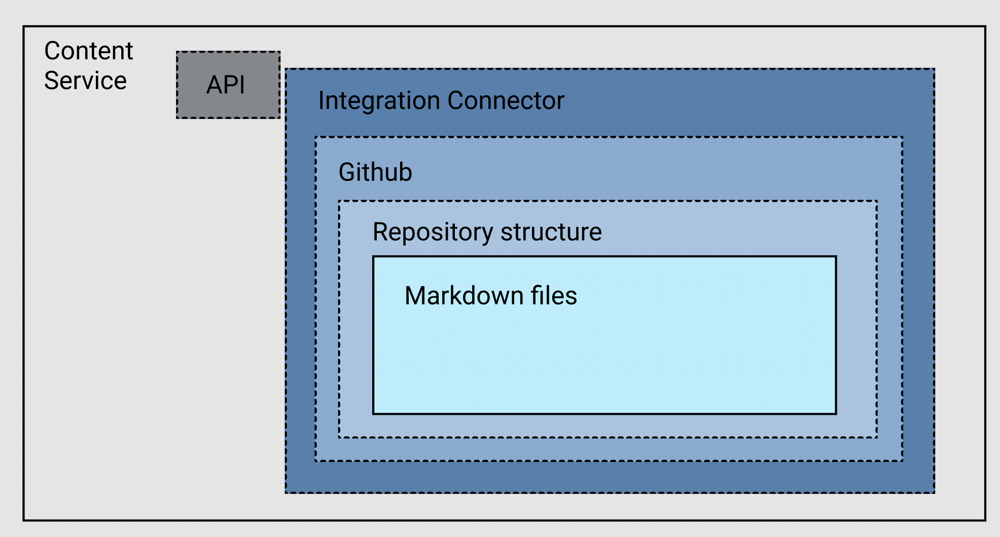
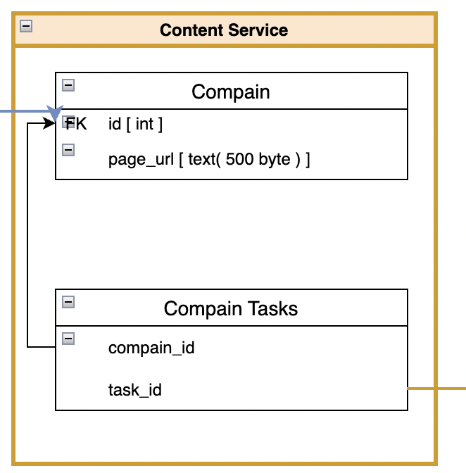

## Content Service



# Data contracts

# Queries

> getCompainList

``` javascript
// input
{
  "includeTask": Boolean
	"compainId": Strnig // filter for Compain
}

// output
[
{
	"id": String,
	"title": Sting,
	"description": String,
	"tasks": []String, //() TaskIdStirng
},
// {...}, {...}, ...
]

```


> getTaskContent

``` javascript
// input
// pass parameter for taskID to query params in url
{"taskId": String} // String -> TaskIdStirng

// output
{
	"title": Sting,
	"description": String,
}

```

