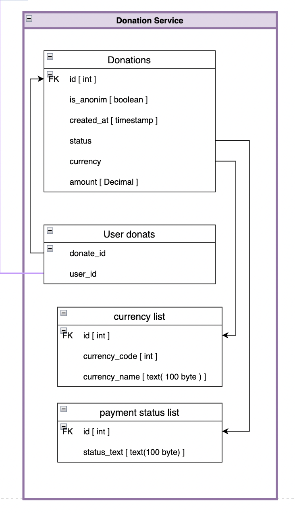

# Data contracts

# Queries


> getDonationList

``` javascript
// input
// pass parameters for filtering and pagination to query params in url
// we always work with date and date always in UTC
{
	"donaterId": String, // (фильтрация)

	"dateStart": String, // (фильтрация) -> DateString (только дата без времени)
	"dateEnd": String, // (фильтрация) -> DateString (только дата без времени)

	"page": Number, // выборка конкретной страницы (пагинация)
	"countRecordsInPage":  Number, // на какое количество элементов разбивать страницы (пагинация)
}

// output
[
	{
		"id": String, //(номер транзакции)
		"donaterId": String,
		"isAnonim": Boolean,
		"status": String // String -> несколько вариантов
		"donatValue": {
			"currency": String //("USD" | "UAH" | ...),
			"amount": Number
		},
	 "createdAt": String //(дата успешного совершения доната)
	},
	// {...}, {...}, ...
]


```


# Commands


> createDonate

``` javascript
// input
{
	"donaterId": String,
	"status": String // String -> несколько вариантов
	"isAnonim": Boolean,
	"donatValue": {
		"currency": String //("USD" | "UAH" | ...),
		"amount": Number
	},
}


```


> confirmationDonate

``` javascript
// input
{
	"id": String, //(номер транзакции)
	"status": String,
	// "createdAt": String (date of successful donation) filled in automatically by the database

}


```
