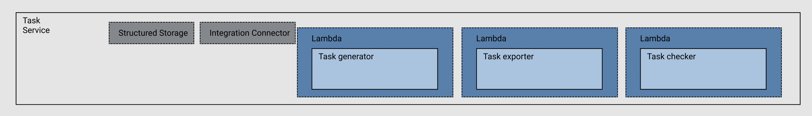
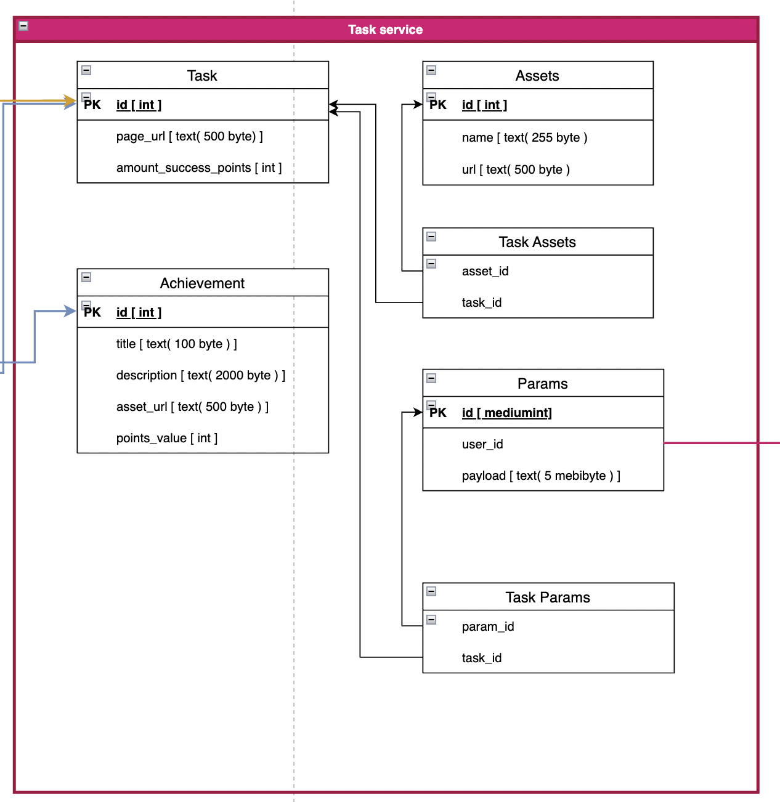

> Structured Storage - You need flexibility in the structure (since the tasks are different, and the answers can have a different structure) - a document-oriented base will do

> Recommendation
> - Lambda - implementation on Node.js



# Data contracts

# Queries


> getTask

``` javascript
// input
// pass parameter for taskID to query params in url
{"taskId": String} // String -> TaskIdStirng

// output
{
	"id": String, //
	"assets": {  //
		String: String, // String -> assetNameStirng, String -> urlString
	},
	"compainID": String,
	"amountSuccesPoints": Number
}

```


> getTaskParamsForSpecialUser

``` javascript
// input
{"userId": String}

// output
	{
		"taskParams": {
			String: Object //String -> TaskIdString, Object-> TaskParmsObject
		}
	},

```


> GetUserAccesTaskList

``` javascript
// pass parameter for taskID to query params in url
{"userId": String}

// output
{
	"accessTasks": []String // String -> TaskIdStirng
}

```


> GetUserCompleteTaskList

``` javascript
// pass parameter for taskID to query params in url
{"userId": String}

// output
{
	"complateTasks": []String // String -> TaskIdStirng
}

```


# Commands

> checkTaskSolution

``` javascript
// if succes -> updated User Complate Task List, UserAccessTaskList, TaskParams
{
	"taskId": String,
	"payload": String,
}
// output
{
	"status": Boolean,
	"taskId": String,
	"earnedPoints": Number,
}

```

# Achivka

> AchivkaItem
``` javascript
{
	"id": String,
  "title": String,
	"description": String,
	"assetUrl": String, // (urlString)
	"pointsValue": Number (за сколько очков можно получить)
}

```

> AchivkaList
``` javascript
{
	"achivks": []Achivka
}

```
